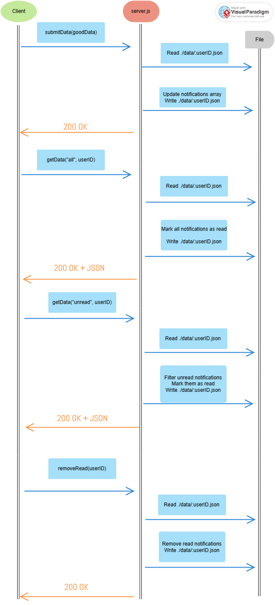

# Communication Contract: Notification Service
#### Install Node Packages

    - in the directory run the command `npm install` to install packages.

## Requesting Data
Clients communicate with the server using HTTP requests on `port 8003`. When the server starts, it will create a `./data` folder if it does not already exist.

### Run Server

    - run the command `npm start` to start the server.

### Example Request
##### Get unread notifications:
`await getData("unread", userID);`

##### Get all notifications:
`await getData("all", userID);`

##### Responses:
`200 OK` -> Notification successfuly submitted

`400 Bad Request` -> Invalid request

`404 Not found` -> No entry found

## Recieving Data
The server always returns a JSON object in the following format. Each element in the notifications array is a notification object with these keys:
- `name` -> name of the notification
- `time` -> time of the notification
- `status` -> "unread" or "read"
- `class` -> type of notification ["alert", "warning", "reminder"]

#### Example Recieve:
Get unread: (1 Unread)

        200 OK
        
{
  notifications: [
    { name: 'test1', time: '15:24', status: 'unread', class: 'alert' }
  ]
}

Get all: (1 Read)

        200 OK
        
{
  notifications: [ { name: 'test1', time: '15:24', status: 'read', class: 'alert' } ]
}
Get no unread: (Empty)

        200 OK
        
{ notifications: [] }

Get bad user: (Not Found)

        404 Not Found

## UML Sequence Diagram
This is a UML sequence for the getData and removeRead functions in the `test.js`

