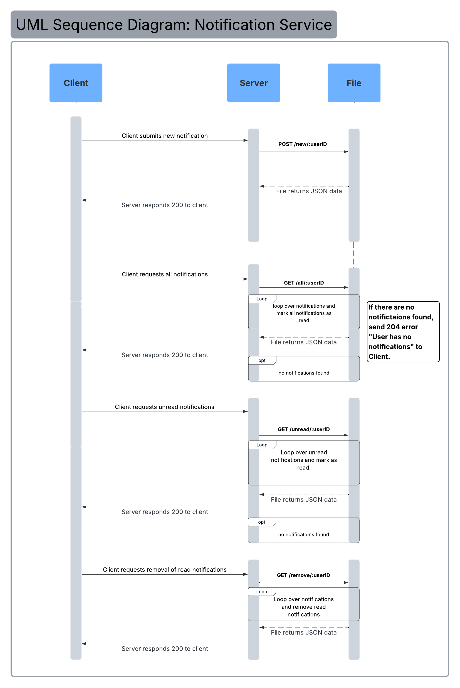

# Communication Contract: Notification Service
#### Install Node Packages

    - in the directory run the command `npm install` to install packages.

## Requesting Data
Clients communicate with the server using HTTP requests on `port 8003`. When the server starts, it will create a `./data` folder if it does not already exist.

### Run Server

    - run the command `npm start` to start the server.

## Example Request
##### Get unread notifications:
`await getData("unread", userID);`

##### Get all notifications:
`await getData("all", userID);`

##### Submit a new notification:
`await submitData({
    name: "test1",
    date: "2025-11-11",
    time: "15:24",
    status: "unread",
    class: "alert",
});`

##### Remove all read notifications:
`await removeRead(userID);`

##### Responses:
`200 OK` -> Notification successfuly submitted

`204 No Content` -> Notification not found

`400 Bad Request` -> Invalid request

`404 Not found` -> No entry found

`500 Server Error` -> Failed to write file.

## Receiving Data
The server always returns a JSON object in the following format. Each element in the notifications array is a notification object with these keys:
- `name` -> name of the notification
- `time` -> time of the notification
- `status` -> "unread" or "read"
- `class` -> type of notification ["alert", "warning", "reminder"]

### Example Receive:
<b> Get unread: (1 Unread) </b> 

        200 OK
        
<b> {
  notifications: [
    { name: 'test1', time: '15:24', status: 'unread', class: 'alert' }
  ]
} </b> 

<b> Get all: (1 Read)  </b>

        200 OK
        
<b> {
  notifications: [ { name: 'test1', time: '15:24', status: 'read', class: 'alert' } ]
} </b>

<b> Get no unread: (Empty)  </b>

        200 OK
        
<b> { notifications: [] }  </b>

<b> Get bad user: (Not Found)  </b>

        404 Not Found

## UML Sequence Diagram

